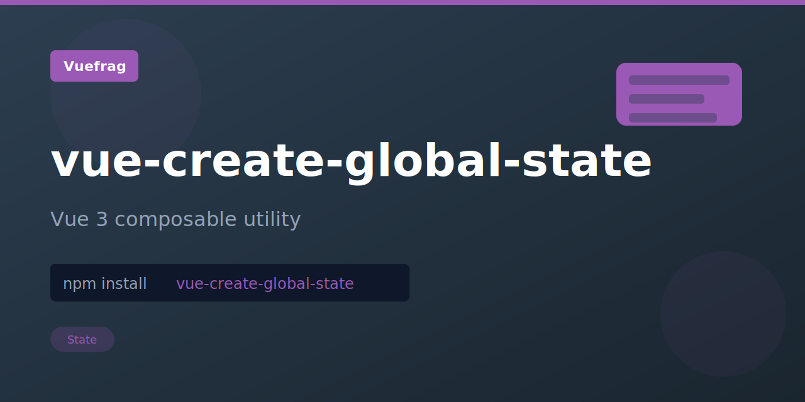

<p align="center">
  
</p>

<h1 align="center">vue-create-global-state</h1>

<p align="center">A Vue 3 composition API utility for creating global reactive state that persists and synchronizes across all component instances without prop drilling or external state management libraries.</p>

<p align="center">
  <a href="https://www.npmjs.com/package/vue-create-global-state"></a>
  <a href="https://www.npmjs.com/package/vue-create-global-state"></a>
  <a href="https://github.com/vuefrag/vue-create-global-state/blob/main/LICENSE"></a>
</p>

## Installation

```bash
npm install vue-create-global-state
```

## Usage

```ts
import { createGlobalState } from 'vue-create-global-state';
```

Keep states in the global scope to be reusable across Vue instances.

### Without Persistence (Store in Memory)

```ts
// store.ts
import { createGlobalState } from 'vue-create-global-state'
import { shallowRef } from 'vue'

export const useGlobalState = createGlobalState(
  () => {
    const count = shallowRef(0)
    return { count }
  }
)
```

A bigger example:

```ts
// store.ts
import { createGlobalState } from 'vue-create-global-state'
import { computed, shallowRef } from 'vue'

export const useGlobalState = createGlobalState(
  () => {
    // state
    const count = shallowRef(0)

    // getters
    const doubleCount = computed(() => count.value * 2)

    // actions
    function increment() {
      count.value++
    }

    return { count, doubleCount, increment }
  }
)
```

### With Persistence

Store in `localStorage` with `useStorage`:

```ts
// store.ts
import { createGlobalState, useStorage } from 'vue-create-global-state'

export const useGlobalState = createGlobalState(
  () => useStorage('vueuse-local-storage', 'initialValue'),
)
```

```ts
// @filename: store.ts
// component.ts
import { useGlobalState } from './store'

export default defineComponent({
  setup() {
    const state = useGlobalState()
    return { state }
  },
})
```

> Extracted from [VueUse](https://vueuse.org/) for standalone use.

## License

MIT
